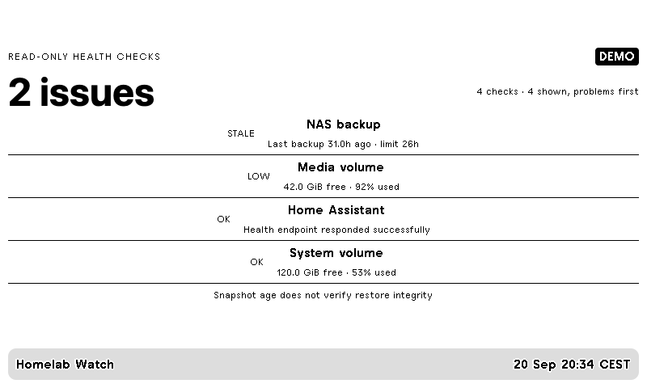

# Homelab Watch / Domácí server pod dohledem



A compact read-only monitor for disk space, HTTP health endpoints and restic backup
freshness. Errors and unknown states rank ahead of successful checks. A failed
check produces a visible warning, never a fabricated healthy state.

Follow the [installation guide](../README.md), edit `config.example.json`, then:

```sh
.venv/bin/python -m trmnl_homelab_watch --config private/config.json --push
```

Run this collector on the machine whose volumes you monitor. Supported checks:

- `disk`: local `path` and `warn_used_percent` (default 85).
- `http`: `url` for a health endpoint that supports HEAD. HTTPS is the default;
  plain HTTP for an explicitly chosen local service requires `allow_http: true`.
  Redirects, unauthorized responses and network failures are reported as unknown.
- `restic`: runs `restic snapshots --json --latest 1`, optionally filtered by
  `host` and backup `path`. Install restic and provide its normal repository/password
  environment variables locally. This command reads metadata; it does not run a backup.
- `restic_file`: read an already-exported JSON array from `file`. Relative paths
  resolve beside your configuration. `host`, `path` and `max_age_hours` also apply.

Example export (only replaces the file after a successful command):

```sh
restic snapshots --json --latest 1 --host nas > private/snapshots.tmp && mv private/snapshots.tmp private/snapshots.json
```

The screen reports the newest matching snapshot, not all hosts or backup jobs.
Configure a separate check per host/path you care about. Snapshot age is not a
restore test or a guarantee of backup integrity. E-paper refresh is periodic;
keep the monitoring system's actual alerts enabled for urgent problems.

Only check names, coarse status and summary values reach TRMNL. Source URLs,
filesystem paths, repository credentials and restic output are not included.
Reference: [restic repository queries](https://restic.readthedocs.io/en/stable/045_working_with_repos.html).
